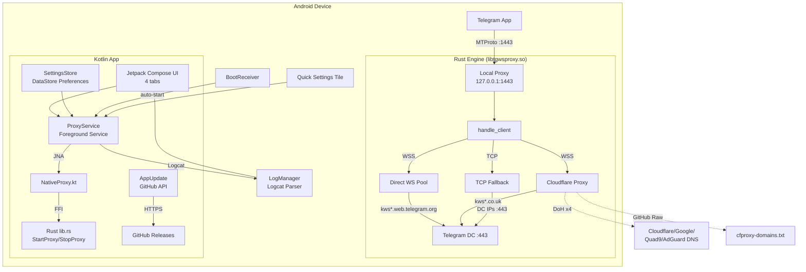
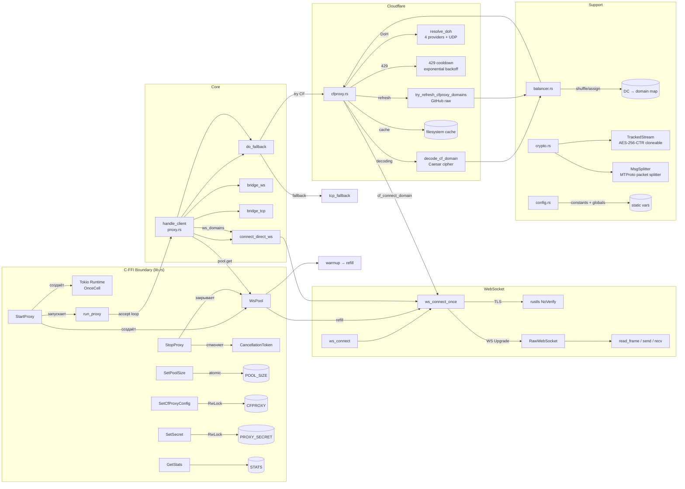
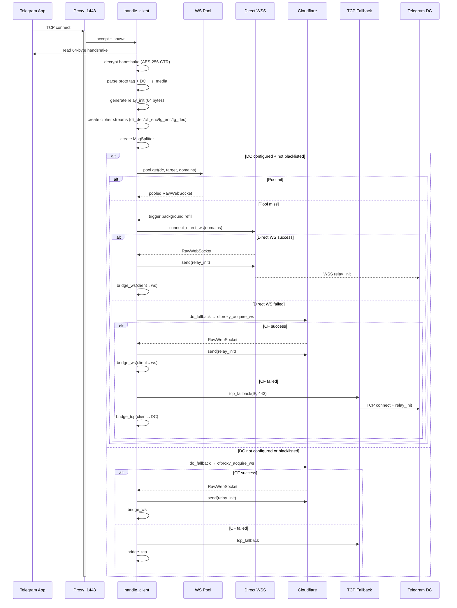
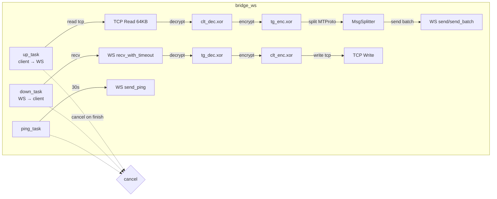
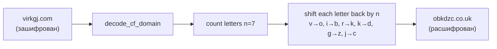
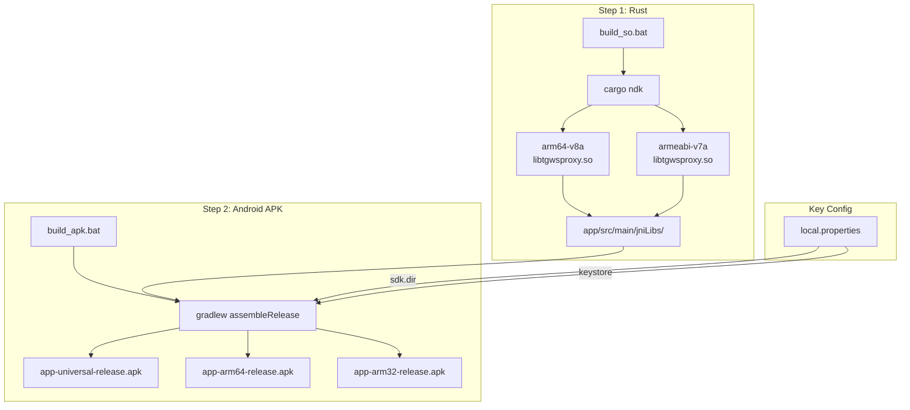
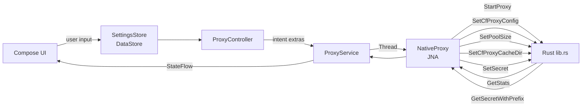

# Архитектура tg-ws-proxy-android

## 1. Общая архитектура

Два слоя: **Rust engine** (нативный `.so`) и **Kotlin/Android app** (APK). Связь через **JNA** (Java Native Access).



---

## 2. Модули Rust



---

## 3. Поток данных при подключении клиента



---

## 4. Детальная схема bridge_ws (основной режим)



---

## 5. Алгоритм Cloudflare Proxy

```mermaid
flowchart TD
    START[StartProxy] --> INIT[init_cfproxy_domains]
    INIT --> CHECK_USER{user_domain<br/>set via UI?}
    CHECK_USER -->|yes| USER_DOMAIN[domains = [user_domain]<br/>skip all other sources]
    CHECK_USER -->|no| CACHE{file cache exists?}
    CACHE -->|yes, fresh| CACHE_LOAD[load + merge<br/>with hardcoded defaults]
    CACHE -->|no/expired| GITHUB[spawn async refresh]
    GITHUB --> GIT_FETCH[GET raw.githubusercontent.com/...<br/>cfproxy-domains.txt]
    GIT_FETCH -->|success| GIT_PARSE[parse + normalize]
    GIT_PARSE -->|merge defaults| GIT_MERGE[merge_cfproxy_domains]
    GIT_MERGE --> SAVE[save to file cache]
    GIT_MERGE --> BAL_UPDATE[update Balancer<br/>shuffle + assign per DC]
    GIT_FETCH -->|fail 3x| KEEP_DEFAULTS[keep defaults + cache]
    CACHE_LOAD --> BAL_UPDATE

    BAL_UPDATE --> BAL[Balancer]
    BAL -->|for each DC 1-5,203| DC_ASSIGN[random domain → dc_to_domain]
    
    CONNECT[do_fallback →<br/>cfproxy_acquire_ws] --> ORDERED[balancer.get_domains_for_dc]

    ORDERED --> FIRST[try first domain<br/>try_cfproxy_base_domain]
    FIRST --> CHECK_429{429 cooldown<br/>active?}
    CHECK_429 -->|yes, skip| SKIP[skip domain]
    CHECK_429 -->|no| ACQUIRE_SEM[acquire global semaphore<br/>max 4 concurrent]
    ACQUIRE_SEM --> CONNECT_DOMAIN[cf_connect_domain]

    CONNECT_DOMAIN --> TRY_HOST[ws_connect_once<br/>by hostname]
    TRY_HOST -->|HTTP 429| MARK_COOLDOWN[mark_cfproxy_429_cooldown<br/>exponential backoff]
    TRY_HOST -->|other error| DOH[resolve_doh<br/>4 providers + UDP]
    DOH -->|got IP| TRY_IP[ws_connect_once<br/>by resolved IP]
    TRY_HOST -->|success OK| RETURN_WS[return RawWebSocket]
    TRY_IP -->|success OK| RETURN_WS
    TRY_IP -->|fail| FAIL[return None]

    FIRST -->|fail| PARALLEL[try remaining domains<br/>parallel with semaphore]
    PARALLEL --> RESULT{any success?}
    RESULT -->|yes| UPDATE_BAL[balancer.update_domain_for_dc]
    RESULT -->|no| ALL_FAIL[log warning<br/>return None → TCP fallback]
```

---

## 6. Структура Kotlin-приложения

```mermaid
graph TB
    subgraph "App Entry"
        MA[MainActivity] -->|Compose| MC[MainContent]
        MC -->|4 tabs| CT[ConnectionTab]
        MC -->|4 tabs| ST[SettingsTab]
        MC -->|4 tabs| LT[LogsTab]
        MC -->|4 tabs| IT[InfoTab]
        
        MC -->|update check| AU[AppUpdate.kt<br/>fetchLatestReleaseInfo]
        AU -->|GitHub API| GHR[GitHub Releases/Tags]
        
        MC -->|logs| LM[LogManager<br/>Channel + batch]
        LM -->|logcat --pid| LOGCAT[ProcessBuilder]
        
        MA --> FT[FloatingToolbar<br/>theme/palette controls]
    end

    subgraph "Service Layer"
        PS[ProxyService<br/>Foreground Service]
        PS -->|JNA Thread| NP[NativeProxy]
        NP -->|FFI| RUST[Rust libtgwsproxy.so]
        
        PS -->|intent extras| PC[ProxyController]
        PC -->|read settings| SS[SettingsStore<br/>DataStore Preferences]
        
        PS -->|wakelock| WL[WakeLock<br/>refresh 25min]
        PS -->|notification| NOTIF[Notification<br/>stats + controls]
        PS -->|3s check| WD[Watchdog<br/>port check]
        
        PS -->|START_REDELIVER_INTENT| AUTO_RESTART[System auto-restart<br/>on kill]
    end

    subgraph "System Integration"
        BR[BootReceiver<br/>BOOT_COMPLETED] -->|auto-start| PS
        QS[ProxyTileService<br/>Quick Settings] -->|toggle| PS
        QTP[ProxyTilePreferencesActivity] --> QS
    end

    subgraph "UI Screens"
        CT -->|Start/Stop| PC
        CT -->|Stats| NP
        CT -->|Notification| TG_PROXY[t.me/proxy URL]
        
        ST -->|DC IPs| SS
        ST -->|CF config| SS
        ST -->|Port/Bind| SS
        ST -->|Pool size| SS
        
        LT -->|filtered| LM
        
        IT -->|links| EXT[ExternalLinks<br/>GitHub URLs]
        IT -->|version| AU
        IT -->|donate| EMPTY["""<br/>(not configured)</li>]
    end

    BU[AppBackdrop<br/>decorative orbs] -.-> MC
```

---

## 7. Управление Cloudflare-доменами (Caesar-шифр)

Жёстко закодированные домены в `config.rs` выглядят как `virkgj.com`, но в runtime декодируются.



---

## 8. Система сборки



---

## 9. Поток данных настроек (UI → Rust)


